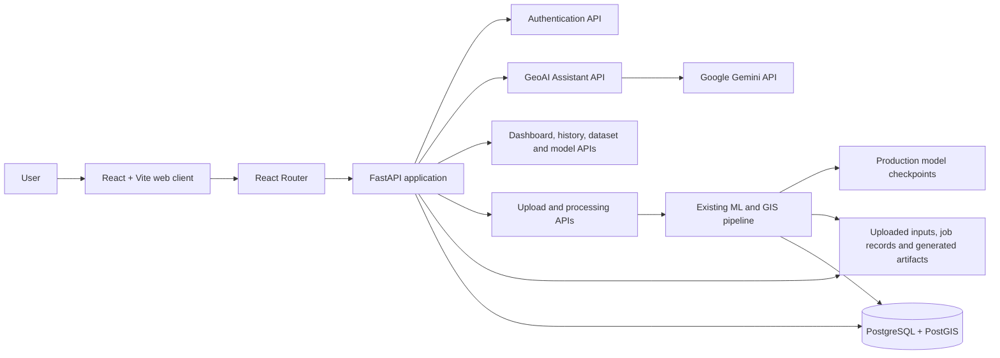
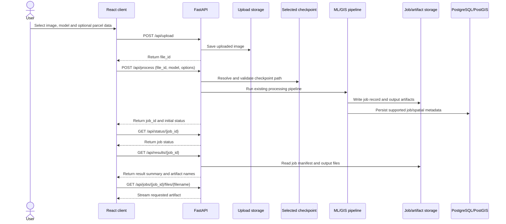
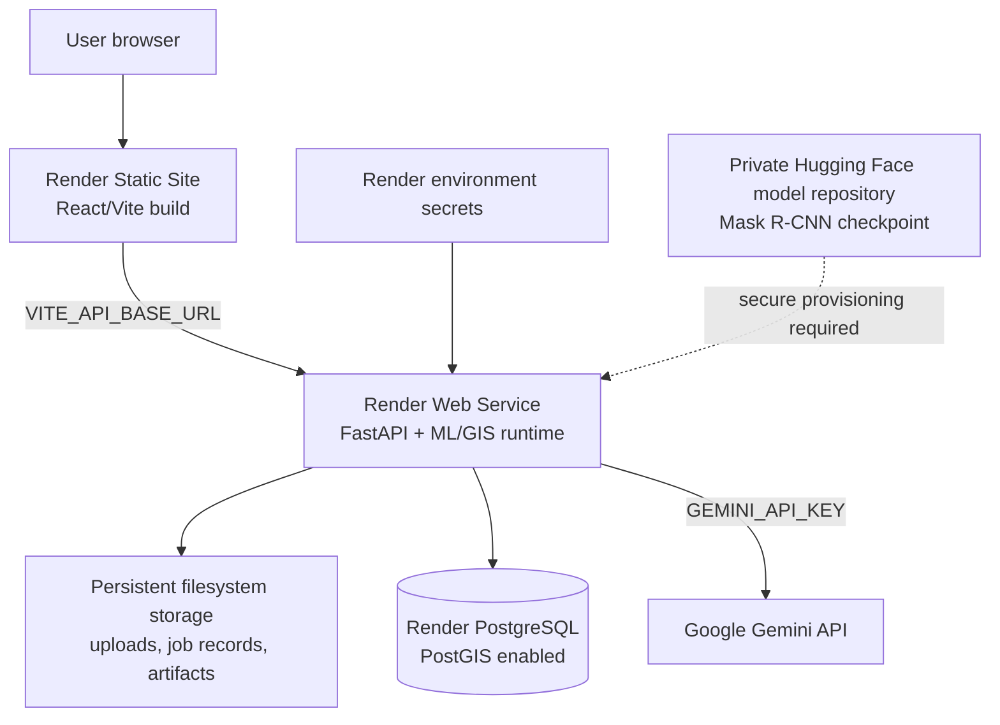

# GeoCadastra — GeoAI Mapping and Cadastral Analysis

GeoCadastra is a geospatial AI application for exploring aerial imagery, running building-footprint extraction, relating building results to cadastral parcels, reviewing generated artifacts, and viewing project and model information.

The repository contains a React/Vite web application, a FastAPI service, ML and GIS processing code, demo and evaluation assets, and automated tests. The API orchestrates the existing processing pipeline; the browser does not run the ML models.

> **Data integrity:** Results depend on the supplied imagery, model checkpoint, parcel layer, coordinate reference system (CRS), and pipeline output. The application should not be treated as a survey or legal cadastral authority without independent validation.

## Smart India Hackathon (SIH) Project

**GeoCadastra** is an AI-powered geospatial platform designed to transform drone and aerial imagery into GIS-ready building and cadastral insights.

### Problem

Conventional aerial-image and cadastral workflows often require separate tools for image analysis, building-footprint extraction, GIS processing, parcel association, and result review. This can make urban mapping workflows time-consuming and difficult to manage in one place.

### Solution

GeoCadastra combines **Computer Vision, GeoAI, and GIS processing** in a unified web platform. Users can upload aerial imagery, select a building-segmentation model, generate building footprints, associate detected buildings with available cadastral parcels, calculate spatial measurements and statistics, and review the generated outputs.

### AI + GIS Approach

- **U-Net++** for semantic building segmentation
- **YOLO11-Seg** for building segmentation
- **Mask R-CNN** for building instance segmentation
- **GIS processing** for footprints, measurements, CRS-aware geographic outputs, and parcel/building relationships
- **GeoAI Assistant** using Google Gemini when configured
- **PostgreSQL/PostGIS** for supported spatial and job metadata

### Key Innovation

GeoCadastra brings the **ML inference → GIS processing → cadastral association → visualization and review** workflow into a single application, while preserving model-specific outputs and supporting multiple building-segmentation approaches.

### SIH Relevance

The platform is intended to support **AI-assisted urban mapping, building-footprint extraction, cadastral analysis, and geospatial decision-support workflows** using drone and aerial imagery.

## Contents

- [Capabilities](#capabilities)
- [System architecture](#system-architecture)
- [Processing flow](#processing-flow)
- [Project layout](#project-layout)
- [Runtime files and model checkpoints](#runtime-files-and-model-checkpoints)
- [Requirements](#requirements)
- [Run locally](#run-locally)
- [Configuration and secrets](#configuration-and-secrets)
- [API overview](#api-overview)
- [Database behavior](#database-behavior)
- [Testing and production build](#testing-and-production-build)
- [Render deployment planning](#render-deployment-planning)
- [Limitations and operational notes](#limitations-and-operational-notes)

  ## Mask R-CNN production checkpoint

The production Mask R-CNN checkpoint is hosted separately because it exceeds GitHub’s standard per-file size limit.

- **Hugging Face repository:** [GeoCadastra Mask R-CNN](https://huggingface.co/shaikhrahella/geocadastra-maskrcnn)
- **Checkpoint:** [`best.pth`](https://huggingface.co/shaikhrahella/geocadastra-maskrcnn/resolve/main/best.pth)
- **Model:** Mask R-CNN
- **Purpose:** Building instance segmentation

Download `best.pth` and place it at:

```text
building_segmentation/runs/maskrcnn/building_instances_fixed/best.pth

## Capabilities

- Authenticated workspace pages for dashboard, analysis, model and dataset browsing, map exploration, results, reports, review, history, settings, and account/profile.
- React-based image upload and processing workflow backed by FastAPI.
- Building inference using the available U-Net++, YOLO11 segmentation, and Mask R-CNN production model options.
- GIS processing for building footprints and, when valid parcel input is supplied, parcel/building relationships and statistics.
- Job status, history, results, artifact inspection, validation, and download flows.
- Dataset registry and model-comparison/demo views using project-provided assets.
- GeoAI Assistant backed by the Google GenAI Python SDK when a server-side Gemini API key is configured.
- SQLAlchemy database integration for job and spatial metadata, with PostgreSQL/PostGIS intended for production.

## System architecture



The application has two primary runtime components:

1. **Web client** — React pages and shared components are built with Vite. API requests are made by the frontend API service.
2. **API and processing service** — FastAPI exposes the application's REST endpoints and invokes the existing Python processing orchestration. The processing code writes job state and artifacts to the filesystem and persists supported metadata to the configured database.

The Gemini API key belongs only in the backend runtime environment. It must not be placed in Vite variables, frontend source, or a committed environment file.

## Processing flow



### Geographic data handling

Geographic output depends on the actual source imagery metadata. A GeoTIFF with usable CRS and affine-transform metadata can support geographic footprints. Image-only inputs without geographic referencing can produce pixel-space diagnostic output, but must not be interpreted as georeferenced cadastral geometry.

Parcel operations require an actual parcel dataset and an applicable parcel identifier field. If parcel data is not supplied or cannot be read, parcel-level results are unavailable rather than inferred.

## Project layout

```text
.
├── src/                              # React pages, components, hooks and API client
│   ├── api/                          # Feature-specific frontend API modules
│   ├── assets/                       # Frontend images and other bundled assets
│   ├── components/                   # Shared and page-level UI components
│   ├── hooks/                        # Authentication, job and demo state
│   ├── layouts/                      # Application shell and navigation
│   ├── pages/                        # Landing, analysis, maps, results and other pages
│   └── services/                     # Shared API client
├── backend/
│   ├── app/
│   │   ├── api/                      # FastAPI route modules
│   │   ├── core/                     # Runtime paths and configuration
│   │   ├── db/                       # SQLAlchemy models and database setup
│   │   ├── schemas/                  # API data schemas
│   │   └── services/                 # Gemini, file and pipeline services
│   ├── .env.example                  # Environment variable template
│   ├── README.md
│   ├── README_DATABASE.md
│   └── requirements.txt
├── building_segmentation/            # Training, inference, datasets and model utilities
│   ├── runs/                         # Production checkpoints and selected previews
│   ├── unet_dataset/                 # Dataset registry and sample browsing data
│   └── requirements.txt
├── gis_processing/                   # Footprint, measurement, parcel and CRS processing
│   ├── input/                        # Project-provided GIS demo inputs
│   └── requirements.txt
├── final_validation/                 # Runtime benchmark and comparison assets
├── tests/                            # Backend and pipeline tests
├── package.json                      # Frontend scripts and dependencies
├── package-lock.json                 # Locked frontend dependency tree
├── run_full_pipeline.py              # Project processing orchestration
└── vite.config.js                    # Vite frontend configuration
```

Some project data directories contain local generated content. Consult `.gitignore` before adding files. Do not commit environment files, credentials, virtual environments, Node dependencies, local databases, user uploads, job history, or generated processing output.

## Runtime files and model checkpoints

The backend model catalog uses these production checkpoint locations:

| Model ID | Checkpoint path | Approximate size | Notes |
|---|---|---:|---|
| `unetpp` | `building_segmentation/runs/unetpp/building_refinement/best.pt` | 57.32 MB | Default processing checkpoint |
| `yolo11` | `building_segmentation/runs/segment/building_yolo11/weights/best.pt` | 5.72 MB | Production segmentation checkpoint |
| `maskrcnn` | `building_segmentation/runs/maskrcnn/building_instances_fixed/best.pth` | 175.37 MB | Production checkpoint; stored separately from ordinary Git source |

The application resolves model paths relative to the project root and rejects missing, empty, unreadable, or out-of-root checkpoint paths. The current application code expects each selected checkpoint to exist at its configured local path. **It does not automatically download the Mask R-CNN checkpoint from Hugging Face.** A deployment process must securely provision the private checkpoint into the expected path before serving model requests.

Additional runtime/demo data currently referenced by backend routes includes:

- `building_segmentation/unet_dataset/` and `Semantic segmentation dataset/` for dataset and demo browsing.
- `building_segmentation/runs/predictions/`, `building_segmentation/unet_evaluation_results/`, and `building_segmentation/maskrcnn_evaluation_results/` for dataset/model preview information.
- `final_validation/final_model_benchmark.json` and visual comparison assets for dashboard comparisons.
- `gis_processing/input/aerial.tif`, `gis_processing/input/ai4boundaries_sampling.gpkg`, and `gis_processing/input/parcels.gpkg` for the included project GIS demo.

Training/resume checkpoints such as `last.pt` and `last.pth`, historical model runs, local uploads, outputs, and job records are not required as source files for a clean deployment unless you specifically choose to preserve that local state.

## Requirements

- Node.js and npm for the React/Vite frontend.
- Python for FastAPI, ML, and GIS processing.
- The Python packages declared by:
  - `backend/requirements.txt`
  - `building_segmentation/requirements.txt`
  - `gis_processing/requirements.txt`
- PostgreSQL with PostGIS for a production geospatial database.
- The production model checkpoints at the exact paths listed above.
- A Gemini API key only if the GeoAI Assistant is to call Gemini.

The Python dependency sets overlap. Install them in a dedicated virtual environment for the project; do not use the project's checked-in/local `.venv` as a deployment artifact.

## Run locally

Run the frontend and API from the repository root in separate terminals.

### 1. Install frontend dependencies

```bash
npm ci
```

### 2. Install Python dependencies

Create and activate a virtual environment using your platform's standard Python tooling, then install the three manifests:

```bash
python -m pip install -r backend/requirements.txt
python -m pip install -r building_segmentation/requirements.txt
python -m pip install -r gis_processing/requirements.txt
```

Geospatial Python packages may require platform-compatible binary wheels or system libraries. Follow the installation guidance for the operating system and packages used by your environment.

### 3. Configure the backend

Copy `backend/.env.example` to `backend/.env` for local use, then set the values appropriate for your local database and optional Gemini access. Never commit `backend/.env`.

At minimum, configure:

| Variable | Purpose |
|---|---|
| `DATABASE_URL` | SQLAlchemy database connection; SQLite is the local default/fallback, while production should use PostgreSQL/PostGIS |
| `GEMINI_API_KEY` | Server-side Gemini credential; leave unset if the assistant is not configured |
| `GEMINI_MODEL` | Gemini model identifier; backend default is `gemini-2.5-flash` |

The example file is a template, not a production credential source. Use secret environment variables in hosted deployments.

### 4. Start FastAPI

```bash
python -m uvicorn backend.app.main:app --reload --host 127.0.0.1 --port 8000
```

FastAPI's interactive API documentation is available at `http://127.0.0.1:8000/docs`.

### 5. Start the frontend

```bash
npm run dev
```

Open the local URL printed by Vite. The frontend API client defaults to `http://127.0.0.1:8000` unless `VITE_API_BASE_URL` is configured. Vite variables are public build-time configuration and must never contain secrets.

## Configuration and secrets

| Setting | Where it is used | Secret? |
|---|---|---|
| `DATABASE_URL` | Backend database connection | Yes; commonly includes database credentials |
| `GEMINI_API_KEY` | Backend Gemini client | Yes |
| `GEMINI_MODEL` | Backend model selection | No |
| `VITE_API_BASE_URL` | Frontend API base URL | No; do not place keys or passwords in Vite variables |

Keep actual values in local ignored environment files or the hosting provider's secret/environment settings. Rotate any credential that was accidentally committed or exposed. Never paste credentials into issues, logs, documentation, screenshots, or chat.

## API overview

FastAPI is defined in `backend/app/main.py`. The principal routes are:

| Area | Routes |
|---|---|
| Health | `GET /health` |
| Authentication | `POST /api/auth/register`, `POST /api/auth/login`, `GET /api/auth/me` |
| Assistant | `GET /api/assistant/status`, `POST /api/assistant/conversations`, `POST /api/assistant/chat` |
| Upload and processing | `POST /api/upload`, `POST /api/process`, `GET /api/status/{job_id}` |
| Results and files | `GET /api/results/{job_id}`, `GET /api/buildings/{job_id}`, `GET /api/parcels/{job_id}`, `GET /api/jobs/{job_id}/files/{filename}` |
| Dashboard and history | `GET /api/dashboard/summary`, `GET /api/history`, `GET /api/postgis/status` |
| Dataset and models | `GET /api/datasets/registry`, `POST /api/datasets/validate`, `GET /api/models/checkpoints` |
| Review | `GET /api/review`, `PATCH /api/review/{review_id}` |
| Demo assets | `/api/demo/...` and `/api/datasets/outputs/...` routes in `backend/app/api/dashboard.py` |

The interactive OpenAPI schema is served by FastAPI at `/docs` when the API is running.

## Database behavior

The backend uses SQLAlchemy models in `backend/app/db/`. It attempts to create the model tables during application startup. The current project does not include an Alembic migration directory; database schema changes should therefore be handled deliberately before production use.

Set `DATABASE_URL` to a PostgreSQL connection with PostGIS available for production spatial records. SQLite is the configured default for local development/tests when no database URL is supplied. A production Render deployment should use a production PostgreSQL database and must verify PostGIS is enabled and reachable; local SQLite fallback is not a substitute for production persistence.

Job metadata and generated files also use filesystem storage. A database connection alone does not preserve uploaded images, job JSON records, or output artifacts.

## Testing and production build

Run backend tests from the repository root using the configured Python environment:

```bash
python -m pytest tests
```

Build the frontend:

```bash
npm run build
```

Vite writes production frontend assets to `dist/`. The generated `dist/` directory is build output and should not be treated as the authoritative frontend source.

## Render deployment planning

The repository currently has no Render Blueprint or Docker deployment manifest. The application is composed of a frontend build and a Python API/processing service; choose and configure the Render services accordingly.

### Suggested service responsibilities



### Deployment checklist

1. **Frontend:** build with the production API base URL supplied as `VITE_API_BASE_URL`. Configure the static host's SPA fallback so client-side routes load through the application entry point.
2. **Backend:** run the FastAPI ASGI app using `backend.app.main:app`, binding to the host and port provided by Render. Confirm the required Python packages and native geospatial dependencies build in the selected Render runtime.
3. **Database:** create or attach a PostgreSQL service, enable PostGIS, configure `DATABASE_URL` as a Render secret/environment value, and verify `/health` and `/api/postgis/status`.
4. **Gemini:** set `GEMINI_API_KEY` as a backend-only Render secret and optionally set `GEMINI_MODEL`. Never define the key as a frontend/Vite variable.
5. **Checkpoints:** provision all three production checkpoints. The U-Net++ and YOLO11 files are in the repository. Retrieve the Mask R-CNN checkpoint from its private Hugging Face repository using a deployment-time credential or another controlled provisioning process, and place it at `building_segmentation/runs/maskrcnn/building_instances_fixed/best.pth`.
6. **Runtime filesystem:** the backend creates and writes upload, job, and output directories below its configured backend base directory (currently resolving to `backend/backend/uploads`, `backend/backend/jobs`, and `backend/backend/outputs`). Configure persistent storage for these paths if uploaded inputs, job history, and generated artifacts must survive service restarts or redeploys.
7. **Demo assets:** keep the selected datasets, GIS inputs, benchmark data, and prediction/evaluation previews at their expected repository-relative paths if those demo and browsing features are required.
8. **Smoke checks:** verify health, login, dataset/model registry, one supported image-processing run, job status/results, artifact download, PostGIS status, and Gemini status/chat as applicable.

Render filesystems are not automatically durable for application-generated files unless persistent storage is configured. Model provisioning, database/PostGIS setup, frontend API URL, CORS/origin policy, and persistent upload/output storage must be validated in the deployed environment; this README does not claim they are already configured.

## Limitations and operational notes

- The application uses the actual checkpoint and input data available to it; it does not make absent model files, CRS metadata, parcels, or activity records appear.
- Inference quality and resource usage depend on the selected model, input size, hardware, and runtime limits. Benchmark results in the project are measurements for their recorded evaluation setup, not a guarantee for every deployment.
- A private external checkpoint needs a secure provisioning mechanism. The current backend validates a local project-relative path and does not fetch private Hugging Face files itself.
- Generated uploads, job records, and result artifacts are filesystem-backed. Back them with persistent storage or an external storage design if they must survive deployment replacement.
- Keep user-uploaded imagery, parcel data, generated outputs, and credentials protected according to their sensitivity and retention requirements.
- CORS, authentication/session behavior, deployment origins, resource limits, and database access should be reviewed before exposing a public production deployment.
